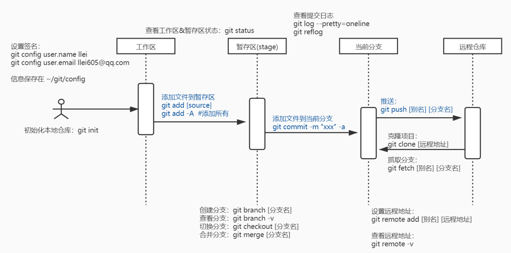

# Git学习笔记

## 一、Git命令行操作



图片地址：https://www.processon.com/diagraming/5ef17d0d07912929cb576505

### 1.1、本地仓库操作

* **本地库初始化**

  语法：

  ​		`git init`

  代码示例：

  ``` shell
  $ git init
  Initialized empty Git repository in xxx/Workspace/Note/Dev/01.Mantainance/.git/
  ```

* **设置签名**

  语法：

  ​		`git config user.name [用户名]`

  ​		`git config user.email [邮箱]`

  代码示例：

  ``` shell
  $ git config user.name llei
  $ git config user.email llei605@qq.com
  
  # 信息保存在 ~\git\config
  ```

* **查看状态（工作区、暂存区）**

  语法：

  ​		`git status`

  代码示例：

  ``` shell
  $ git status
  
  On branch master  # 当前分支处于：master
  Changes not staged for commit:
    (use "git add <file>..." to update what will be committed)
    (use "git checkout -- <file>..." to discard changes in working directory)
  
          modified:   bbb  # 修改过的文件
  
  Untracked files:
    (use "git add <file>..." to include in what will be committed)
  
          ddd  # 新增的文件
  
  no changes added to commit (use "git add" and/or "git commit -a")
  ```

* 添加文件到git暂存区

  ``` shell
  git add [文件名/文件夹名]
  
  # 添加所有
  git add -A
  ```

* 添加文件到git本地库

  ``` shell
  git commit -m "xxxxx" -a
  ```

* 查看git提交日志

  ``` shell
  git log --pretty=oneline
  
  git reflog
  ```

* 前进/后退版本

  ``` shell
  git reset --hard [索引值]
  ```

* 比较文件差异

  ``` shell
  git diff [文件名]
  git diff
  ```

* 分支管理

  * 查看分支

    ```shell
    git branch -v
    ```

  * 创建分支

    ``` shell
    git branch [分支名]
    ```

  * 切换分支

    ``` shell
    git checkout [分支名]
    ```

  * 合并分支

    ``` shell
    # step 1、切换到被合并的分支上
    # step 2、
    git merge [分支名]
    ```

  * 解决冲突

    ```shell
    https://www.bilibili.com/video/av51983266/?p=26
    
    # 编辑文件，删除特殊符号
    # 把文件修改到满意的程度
    git add
    git commit -m "xxxxx"
    # 注意：此时commit不能带具体的文件名
    ```

### 1.2、远程仓库操作

* 设置远程地址别名

  ``` shell
  git remote add [别名] [远程地址]
  ```

* 查看远程地址别名

  ``` shell
  git remote -v
  ```

* 推送git到远程仓库

  ``` shell
  git push [别名] [分支名]
  ```

* 克隆git远程仓库

  ``` shell
  git clone [远程地址]
  ```

* 拉取git远程仓库

  ``` shell
  git fetch [别名] [分知名]
  ```

* 冲突解决

  ```shell
  # 如果不是基于远程仓库的最新版本所做的修改，不能推送，必须先拉取；
  # 拉取后，按照分支冲突的操作解决即可。
  ```

## 二、团队操作

### 2.1、乙团队的操作

* 复制甲团队的远程仓库到自己的远程仓库；
* 克隆git远程仓库到git本地仓库；
* 修改内容；
* 推送到远程仓库。

### 2.2、甲团队的操作

* 在线审核代码；
* 合并代码。

## 三、免密登陆

* 在工作去生成密钥

  ``` shell
  ssh-keygen -t rsa -C [登陆账号]
  ```

* 在网站上输入密钥

* 修改别名

